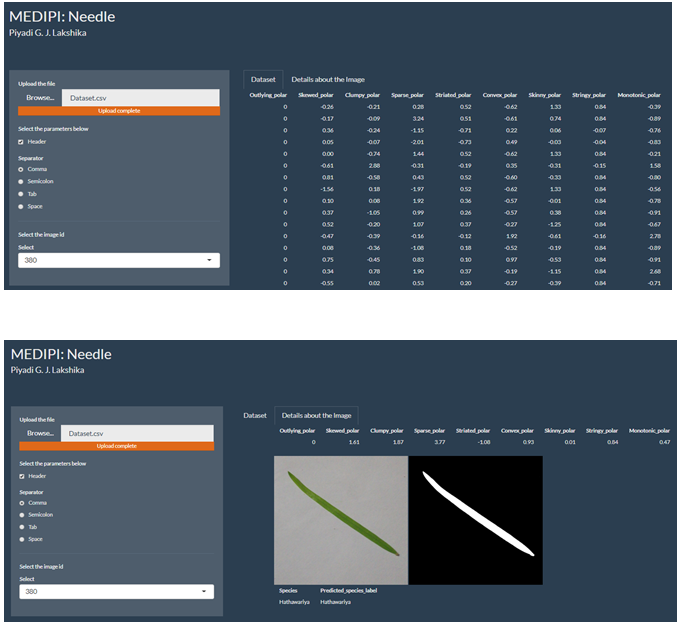
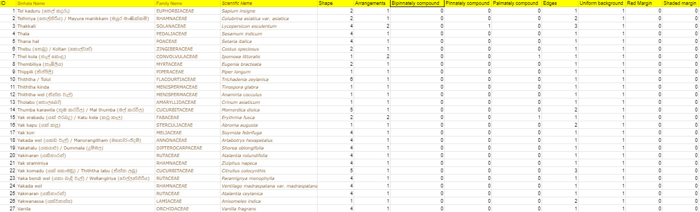

```{r setup, include=FALSE}
options(htmltools.preserve.raw = FALSE)
```

```{r,comment=NA, message=FALSE, warning=FALSE, echo=FALSE}
library(readxl)
library(tidyverse)
library(ggplot2)
library(viridis)
library(maps)
library(sf)
library(forecast)
library(here)
library(patchwork)
library(MASS)
library(scales)
```

class: center, middle

## My SUPERVISOR

```{r, echo=FALSE, out.width="30%", fig.align='center'}

``` 

Dr. Thiyanga S. Talagala

Senior Lecturer in the Department of Statistics, Faculty of Applied Sciences at the University of Sri Jayewardenepura

PhD in Statistics, Monash University, Australia

https://thiyanga.netlify.app/

---
class: center, middle

```{r, echo=FALSE, out.width="80%", fig.align='center'}

```

```{r, echo=FALSE, out.width="30%", fig.align='center'}

```

---
background-image: url("bg1.png")
background-size: 900px
background-position: 90% 8%


---
## Main objective

- **.red[To develop an automatic algorithm to classify medicinal plants by using statistical machine learning approach]**

```{r, echo=FALSE, out.width="30%", fig.align='center'}

``` 

---
# Limitations

**Why medicinal plant leaves?**

--
- Leaf images are considered as they contain large number of diverse set of features such as **.orange[shape, veins, edge features, apices, etc]**. 


--
- We used **.red[non-diseased leaves with simple arrangement]**.

--
- We used the leaves **.red[without a petiole.]** 

---
# Significance of the study

- **.red[To avoid misidentifying medicinal plants in Sri Lanka]**

- The algorithm developed by us is based on the leaf images. Since leaves are **.red[relatively easy to obtain without damaging the plants]**, there is no harm for the plants because of the development of algorithm. 

- Our algorithm works as a hierarchical classification system. Therefore even though we don't know the exact species name, we can follow the first 2 levels. As the result of that **.red[misidentification rate and computation time will be decreased]**.

```{r, echo=FALSE, out.width="60%", fig.align='center'}

``` 

---
class: inverse, center, middle

# Methodology


---
## Workflow

```{r, echo=FALSE, out.width="50%", fig.align='center'}

```


---
## Image Acquisition


- A database of leaf images of medicinal plants in Sri Lanka **.orange[is not yet available]**. 

- **.green[Establish a repository of medicinal plant images]**. 

- Preliminary study by using **.red[471 medicinal plants]** and recorded their characteristics like **.purple[leaf arrangement, shape, edge type etc]**.


---
- Collected **.red[1099]** leaf images from **.red[31 species]**


**MedLEA: Medicinal LEAf**

```{r, echo=FALSE, out.width="55%", fig.align='center'}

``` 

repository is made available to the public through an **.red[open-source R software MedLEA]**, available at url(https://CRAN.R-project.org/package=MedLEA) for research reproducibility

**.red[Total downloads: More than 1000]**
---


---
## Methodology Diagram

```{r, echo=FALSE, out.height="110%",out.width="110%", fig.align='center'}

``` 


---
# Image processing

- The image processing receives an image as input and generates a **.green[modified image]** as an output which is suitable for better **.orange[morphological analysis, feature extraction]**. 

- Image processing is an essential step to **.red[reduce noise, background subtraction and content enhancement]** in the identification process. 


--
 

---
## Methodology Diagram

```{r, echo=FALSE, out.height="110%",out.width="110%", fig.align='center'}

``` 


---

# Why feature extraction is important?

- Recently, many researchers use deep learning methods like CNN (Convolution Neural Network) to classify plants - directly using plant images. 

- Even though deep learning models have achieved great success, their interpretability, and transparency of the deep learning models are limited.

```{r, echo=FALSE, out.height="110%",out.width="110%", fig.align='center'}
knitr::include_graphics("CNN.png")
``` 
---

# Features

- In identification of plant species by using leaf images, **.green[features of the leaves play a main role]**.

--

- In previous research, let the algorithm like **.red[CNN]** to extract features by itself and do the classification. 

--

- Therefore it is so **.purple[hard to interpret and generalize]** the features. 

--

- We introduced **.red[pre-calculate features]** which can be **.green[easy to interpret and generalize]**. They are also **.green[computational efficient]**. 

--
```{r, echo=FALSE, out.width="80%", fig.align='center'}

```

- We identified altogether **.orange[52 features]**.

---
### Shape features
```{r, echo=FALSE, out.width="80%", fig.align='center'}

```

**New shape features: Correlation of cartesian coordinate, number of convex points, number of minimum and maximum points**

```{r, echo=FALSE, out.width="45%", fig.align='center'}

```
---
class: center, middle

**Diameter calculation**


---
### Color features

```{r, echo=FALSE, out.width="50%", fig.align='center'}

```

```{r, echo=FALSE, out.width="60%", fig.align='center'}

```

---
### Texture features

```{r, echo=FALSE, out.width="90%", fig.align='center'}

```

---
```{r, echo=FALSE, out.width="50%", fig.align='center'}

```

```{r, echo=FALSE, out.width="50%", fig.align='center'}

```

---
### Scagnostic features

```{r, echo=FALSE, out.width="70%", fig.align='center'}

```

---
```{r, echo=FALSE, out.width="60%", fig.align='center'}

```

---
## Visualization of Leaf Images in the Feature Space
Example: Flavia

- LDA is a supervised dimensionality reduction technique, and PCA is unsupervised dimensionality reduction technique

- The first **.green[three principal components (PCs)]** accounting for approximately **.red[83%]** of the total variance in the original data

```{r, echo=FALSE, out.width="70%", fig.align='center'}

```

---
class: inverse, center, middle

# Let's see the 3D View
---

```{r, echo=FALSE, out.width="100%", fig.align='center'}

```

- Under both experimental settings class separation is **.orange[more clearly on the LDA space than the PCA space]**. The reason could be LDA is a supervised learning algorithm while PCA space is an unsupervised learning algorithm.

---


---
class: inverse, center, middle

# Algorithm Development


---


- Our medicinal plant classification algorithm contains **.green[two process: Training process and Test process]**.

- Our classification algorithm operates on the **.purple[features extracted from the image leaves]**. 

- The training process e of the algorithm contains four main steps: **.orange[i) Image processing, ii) Feature extraction, iii) Label images, and iv) Trained a algorithm]**.

- In the test process, image processing and feature extraction steps are followed by the **.orange[new image before feed to the pre-trained model]**. 

- Mainly **.red[Random Forest, Gradient Boosting and Extreme Gradient Boosting]** classification algorithms are used in our research.

```{r, echo=FALSE, out.width="70%", fig.align='center'}

```

---
### MEDIPI: MEDIcinal Plant Identification 

```{r, echo=FALSE, out.width="20%", fig.align='center'}

```

Our medicinal plant classification algorithm is defined as **.red[MEDIPI]**. 

```{r, echo=FALSE, out.width="60%", fig.align='center'}
knitr::include_graphics("algo_new_1.png")
```

---
class: inverse, center, middle

# Discussion & Conclusions


---
# Hierarchical Approach

- Our algorithm works as a **.red[hierarchical classification system]**. The hierarchy contains **.purple[3 levels]**. The first level classifies images according to the **.red[shape]**. The second level classifies according to the **.red[edge types]**. The bottom level classifies the **.red[plant species]**.


---
## Hierarchy of Actual leaf image dataset


---
## Hierarchy of Flavia leaf image dataset


---
class: center, middle

### Experiments


We have to use **.orange[training/test from same dataset]** to get accurate results.

---
## Compare results features of all categories and only with shape features
Training and test datasets from same dataset

```{r, echo=FALSE, out.width="80%", fig.align='center'}

```

---
## Compare results features of all categories and only with shape features
Training and test datasets from different datasets

```{r, echo=FALSE, out.width="70%", fig.align='center'}

```


---
# Compare algorithms

```{r, echo=FALSE, out.width="80%", fig.align='center'}

```

The model trained with **.red[Random Forest]** algorithm provides the highest accuracy.


---

## Linear Discriminant Analysis

- High dimensional visualization approach  

- To visualize what is **.red[happening inside]** the trained algorithm and provides **.red[transparency]** to our black-box model


---


---


---


---


---


---


---
## Conclusions

- The model trained with **.red[random forest]** algorithm provides the highest accuracy.

--

- Our algorithm works as a **.red[hierarchical classification system]**. 

--
- We observe that **.red[shape features]** like (i) x value of Center (cx), (ii) y value of Center (cy), (iii) Entropy, (iv) Perimeter ratio of length and width, (v) Diameter, (vi) Area convexity, (vii) Perimeter convexity, (viii) Narrow Factor, (ix) Area ratio convexity, (x) Physiological length, (xi) Physiological width, (xii) Rectangularity, and (xiii) Eccentricity are more important when classify the leaf images in the **.red[first level]** of the hierarchy. 

- **.red[Scagnostic features]** like (i) Monotonic contour, (ii) Convex polar, (iii) Convex contour, (iv) Striated polar, (v) Striated contour, (vii) Skinny contour, and (vii) Skinny contour are more important in identifying leaf species in the **.red[bottom level]** of the hierarchy.

--
- The **.red[MEDIPI]** algorithm yields accurate results to the state-of-the existing techniques in the field. 

--
- We have to use **.red[training/test from same dataset]** to get accurate results.  

--
- We observe that **.red[shape feature is not sufficient]** to classify leaf images. 


---
class: inverse, center, middle

# Thesis Outcome


---
class: center, middle
## MedLEA

```{r, echo=FALSE, out.width="80%", fig.align='center'}

``` 

https://CRAN.R-project.org/package=MedLEA

---
class: center, middle

background-color: #c2a5cf

## Research paper 
```{r, echo=FALSE, out.width="105%", fig.align='center'}

``` 

https://arxiv.org/abs/2106.08077

---
## Web Application for Leaf Image Identification

```{r, echo=FALSE, out.width="70%", fig.align='center'}

```

---
```{r, echo=FALSE, out.width="80%", fig.align='center'}

```

---
background-color: #bdbdbd

# Applied Statistics Conference 2021 (Solvenia)

```{r, echo=FALSE, out.width="70%", fig.align='center'}

```

https://akastrin.si/as2021/

---
background-color: #bdbdbd

# Young Scientists' Conference on Multidisciplinary Research (YSCMR 2021)
## Organised by the Young Scientists’ Association of the National Institute of Fundamental Studies, Sri Lanka (NIFS-YSA)

```{r, echo=FALSE, out.width="30%", fig.align='center'}

```

---
class: center, middle
# Thanks!

Slides created via the R package [**xaringan**](https://github.com/yihui/xaringan).

Slides are available at github: https://github.com/JayaniLakshika/Estadistica_2021

---

class: center, middle



 The website "AYURVEDIC MEDICINAL PLANTS OF SRI LANKA" (\url(http://www.instituteofayurveda.org/plants/))


---
# Robust scaling

- If there are input variables that have very large values relative to the other input variables, these large values can dominate or skew some machine learning algorithms (eg: ANN, KNN, SVM etc).

- The result is that algorithm pay more attention to the large values and ignore the variables with smaller values. 


---


---
Flavia hierarchy


---

## Synthetic Minority Oversampling Technique (SMOTE)

- Imbalance dataset is a classification problem where the class distribution is biased or skewed or not uniform. Most machine learning algorithms for classification are designed under the assumption that each class has an equal number of observations. That results, especially for the minority class in the model, has poor predictive performance. Even though minority class is more important, classification errors for minority class is more sensitive than majority class.

- One remedy for class imbalance is to use an over-sampling method. SMOTE is an over-sampling method which creates synthetic (not duplicates) samples for the minority class and makes the minority class equal to the majority class. By selecting similar records and altering that record one column at a time by random amount within the difference to the neighbouring records, SMOTE handles the imbalance problem.

---
class: inverse, center, middle

# Key Insights


---


- Most of the research are based on existing databases. Even though researchers used their own database most of the time they didn't define image acquisition process in detail or it was complex. Therefore through this research, we introduced simplest and reliable approach of acquiring leaf images which can be followed without expertise knowledge. 

--

- To classify leaf images, several reliable automatic procedures are used. But we introduced a hierarchical approach which perform better than non hierarchical approaches. 

--
- Random Forest in hierarchical approach

--
- We have to use training/test from same dataset to get accurate results.  


---

# Further Research

- Develop algorithms to identify plant disease in Sri Lanka

--
- Expand the species collection

--
- Explore differences in plant features according to spatial distributions and climate conditions (For example, Gotukola leaf in Colombo is smaller than in Anuradhapura)

--
- Develop an algorithm to handle images with heterogeneous backgrounds